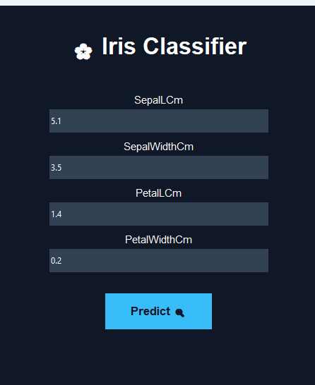
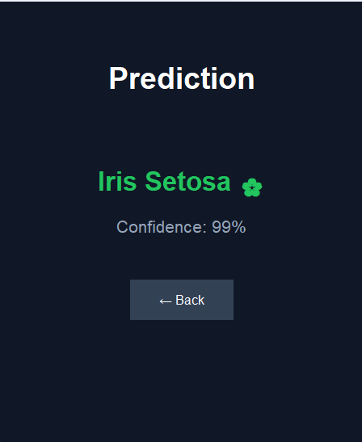

# 🌸 Iris Flower Classifier

A simple **Machine Learning Iris Flower Classifier** built with **Python** and **Tkinter**.

This project uses a trained machine learning model from **Machine Learning for Kids** to predict the type of Iris flower based on four measurements:

- 🌿 Sepal Length
- 🌿 Sepal Width
- 🌸 Petal Length
- 🌸 Petal Width

The application provides a simple graphical interface where the user enters the measurements and gets the predicted flower species along with the model's confidence.

---

## 📌 Project Overview

The goal of this project is to demonstrate how a Machine Learning model can be connected to a Python desktop application.

The project uses the well-known **Iris dataset**, which contains measurements of three different Iris flower species:

- 🌸 Iris Setosa
- 🌺 Iris Versicolor
- 🌷 Iris Virginica

The trained model receives four numerical values and returns the most likely flower species.

---

## ✨ Features

- 🌸 Iris flower classification
- 🤖 Machine Learning prediction
- 🖥️ Graphical User Interface with Tkinter
- 📊 Prediction confidence
- 📁 Excel and CSV datasets included
- 📓 Jupyter Notebook included
- 🧠 Custom `MLforKidsNumbers` model loader
- 🔢 Numerical input support
- 🎯 Three-class classification

---

## 🖥️ Application

The application provides a simple interface where the user can enter the measurements of an Iris flower.

### Input

The user enters:

```text
Sepal Length (cm)
Sepal Width (cm)
Petal Length (cm)
Petal Width (cm)
```

For example:

```text
Sepal Length: 6.1
Sepal Width:  2.8
Petal Length: 4.7
Petal Width:  1.2
```

### Input Example



---

## 🔮 Prediction

After entering the measurements, the application sends the values to the Machine Learning model.

The model returns the predicted species and its confidence.

For example:

```text
Prediction

Iris Versicolor 🌺

Confidence: 96%
```

### Prediction Example



---

## 🧠 Machine Learning

The model is trained to classify Iris flowers into three categories:

| Species | Description |
|---|---|
| `setosa` | Iris Setosa |
| `versicolor` | Iris Versicolor |
| `virginica` | Iris Virginica |

The model uses these four features:

| Feature | Description |
|---|---|
| `SepalLCm` | Sepal Length in centimeters |
| `SepalWidthCm` | Sepal Width in centimeters |
| `PetalLCm` | Petal Length in centimeters |
| `PetalWidthCm` | Petal Width in centimeters |

> `LCm` means **Length in Centimeters**.

---

## 🛠️ Technologies

This project was built using:

- Python
- Tkinter
- Pandas
- YDF
- Requests
- Machine Learning for Kids
- Jupyter Notebook
- CSV
- Excel

---

## 📂 Project Structure

```text
Iris-Flower-Classifier/
│
├── iris.py
├── iris.ipynb
├── mlforkidsnumbers.py
│
├── iris_dataset.xlsx
├── test.xlsx
├── train.xlsx
│
├── train_setosa.csv
├── train_versicolor.csv
├── train_virginica.csv
│
├── Value.png
├── Predict.png
│
└── README.md
```

---

## 📄 File Description

### `iris.py`

The main Python application.

It contains the Tkinter graphical interface and sends the user's input to the trained machine learning model.

### `iris.ipynb`

A Jupyter Notebook used for experimenting with the Iris dataset and Machine Learning model.

### `mlforkidsnumbers.py`

A Python class used to download, load and use the Machine Learning for Kids numerical model.

The main class is:

```python
MLforKidsNumbers
```

The model can be used with:

```python
project.predict(testvalue)
```

### `iris_dataset.xlsx`

The main Iris dataset containing flower measurements and their corresponding species.

The dataset contains:

```text
Sepal Length
Sepal Width
Petal Length
Petal Width
Species
```

### `train.xlsx`

Training data used for the Machine Learning project.

### `test.xlsx`

Testing data used to evaluate the model.

### `train_setosa.csv`

Training examples for the Setosa class.

### `train_versicolor.csv`

Training examples for the Versicolor class.

### `train_virginica.csv`

Training examples for the Virginica class.

### `Value.png`

Screenshot showing the input values used by the application.


### `Predict.png`

Screenshot showing the prediction result produced by the application.


---

## 🚀 Installation

First, make sure Python is installed on your computer.

Install the required packages:

```bash
pip install pandas requests ydf openpyxl
```

Tkinter is normally included with Python.

If you are using Linux and Tkinter is not installed, you may need:

```bash
sudo apt install python3-tk
```

---

## ▶️ Running the Project

Clone the repository:

```bash
git clone https://github.com/YOUR-USERNAME/YOUR-REPOSITORY.git
```

Go to the project directory:

```bash
cd YOUR-REPOSITORY
```

Install the dependencies:

```bash
pip install pandas requests ydf openpyxl
```

Then run:

```bash
python iris.py
```

The Tkinter application should open.

---

## 🔢 How Prediction Works

The application creates a dictionary containing the four measurements:

```python
testvalue = {
    "SepalLCm": sepal_length,
    "SepalWidthCm": sepal_width,
    "PetalLCm": petal_length,
    "PetalWidthCm": petal_width
}
```

The data is then passed to the model:

```python
results = project.predict(testvalue)
```

The result with the highest confidence is selected:

```python
top_match = project.predict(testvalue)[0]
```

The application then displays:

```text
Flower Species
+
Confidence Percentage
```

---

## 🌱 Example

Input:

```text
Sepal Length: 6.1 cm
Sepal Width:  2.8 cm
Petal Length: 4.7 cm
Petal Width:  1.2 cm
```

Possible result:

```text
Iris Versicolor

Confidence: 95%
```

---

## 🎯 Purpose

This project was created as a practical introduction to:

- Machine Learning
- Classification
- Python programming
- Tkinter GUI development
- Working with datasets
- Using a trained ML model inside an application

It demonstrates how a Machine Learning model can be turned into a simple desktop application that accepts user input and produces a prediction.

---

## 📚 Dataset

The project is based on the classic **Iris dataset**, one of the most commonly used datasets for learning Machine Learning classification.

Each sample contains four numerical measurements:

```text
Sepal Length
Sepal Width
Petal Length
Petal Width
```

The target is the Iris species.

---

## 🔮 Future Improvements

Some possible improvements for the project:

- Add input validation and measurement ranges
- Display confidence for all three species
- Add prediction history
- Add charts for flower measurements
- Improve the graphical interface
- Add dark/light mode
- Add an option to load data from a CSV file
- Add model accuracy evaluation
- Compare multiple Machine Learning models
- Add more flower datasets

---

## 👨‍💻 Author

Created as a Python and Machine Learning project.

If you like this project, feel free to ⭐ the repository!

---

## ⭐ Support

If this project helped you learn something about Python or Machine Learning, consider giving the repository a star.

Thanks for checking out the project! 🌸
